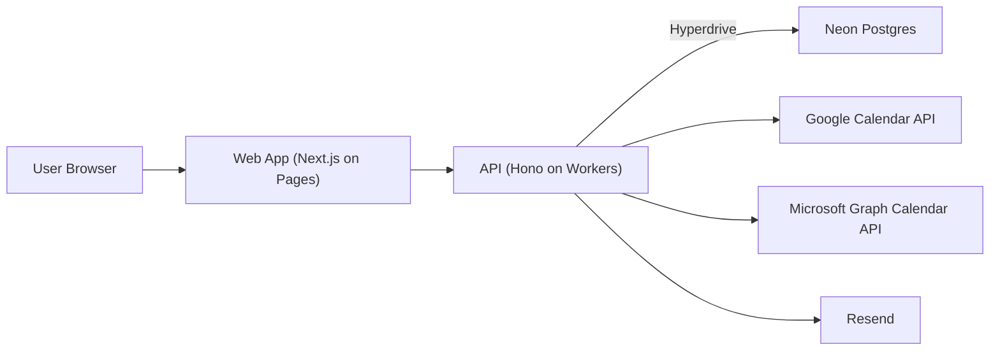

# Architecture

## System diagram

## Data model overview

- `users`: account identity and timezone.
- `sessions`: session tokens (DB-backed auth sessions).
- `event_types`: host-defined booking templates.
- `teams`: organizer-owned teams.
- `team_members`: team membership + role.
- `team_event_types`: links a base event type to a team scheduling mode (`round_robin`/`collective`).
- `team_event_type_members`: required members for a team event type.
- `availability_rules`: recurring weekly availability windows.
- `availability_overrides`: date-specific changes.
- `bookings`: confirmed/canceled/rescheduled booking records.
- `team_booking_assignments`: per-member slot assignment rows for team bookings (enforces member-level uniqueness).
- `calendar_connections`: encrypted OAuth credentials + sync cursor/status per user/provider.
- `calendar_busy_windows`: normalized external busy windows used for slot conflict blocking.
- `booking_external_events`: provider writeback state per booking (`create`/`cancel`/`reschedule`) with retry metadata.
- `webhook_subscriptions`: organizer-managed outbound webhook endpoints/secrets/event filters.
- `webhook_deliveries`: queued delivery attempts with retry state and final status.
- `analytics_funnel_events`: page/slot/booking funnel stages keyed by organizer + event type.
- `email_deliveries`: best-effort delivery telemetry for confirmation/cancellation/reschedule emails.
- `idempotency_requests`: request dedupe records for booking mutations (`scope + key hash + request hash + replay payload`).

## Frontend architecture (post-v1 parity track)

- Global app chrome wraps all routes and provides:
  - primary navigation
  - session state affordances (signed-in identity + sign-out)
  - theme toggle control
- Theme system:
  - CSS variable tokens in global stylesheet (`light` + `dark`)
  - persisted theme preference (`light` | `dark` | `system`) in browser storage
  - early `data-theme` hydration script to reduce theme flash during SSR/CSR handoff
- Auth session model:
  - client-side `AuthSession` store in localStorage
  - shared hook to observe/update session across tabs via storage + custom events
  - bootstrap validation through `GET /v0/auth/me` before loading authenticated dashboard data
- Auth route shells:
  - `/auth/sign-in` requests one-time token via `POST /v0/auth/magic-link`
  - `/auth/verify` exchanges token via `POST /v0/auth/verify`, stores session, then redirects
- Organizer console shell:
  - `/organizer` is the authenticated operational UI over organizer APIs:
    - event type management (`GET/POST/PATCH /v0/event-types`)
    - availability management (`GET /v0/me/availability`, `PUT /v0/me/availability/*`)
    - team/membership/team-event management (`GET /v0/teams*`, `POST /v0/teams*`, `POST /v0/team-event-types`)
    - webhook operations (`GET/POST/PATCH /v0/webhooks`, `POST /v0/webhooks/deliveries/run`)
    - calendar sync + writeback operations (`/v0/calendar/*`)
- Calendar OAuth callback shells:
  - `/settings/calendar/google/callback`
  - `/settings/calendar/microsoft/callback`
  - each callback completes provider OAuth by calling `/v0/calendar/{provider}/connect/complete` with the returned code/state
- Typed API client utilities:
  - centralized authenticated `GET`/`POST`/`PATCH`/`PUT` wrappers
  - organizer-focused typed client module used by console panels
  - normalized error extraction from API payloads for consistent UI state handling

## Critical flows

### Compute availability

1. Load weekly availability rules for organizer.
2. Apply date overrides for query range.
3. Remove windows blocked by existing bookings and buffers.
4. Remove windows blocked by synced external busy windows (Feature 6).
5. Return timezone-aware slots in paginated form.

### Book slot (no double-book)

1. Client selects slot and submits booking request.
2. API validates payload with Zod.
3. API runs DB transaction and inserts booking.
4. Transaction re-check includes external busy windows.
5. Unique slot constraint rejects race-condition duplicates.
6. API returns success and sends confirmation email.

### Reschedule/cancel

1. User opens secure tokenized link from email.
2. API validates token, permission, and booking state.
3. API updates booking status/history atomically.
4. API sends reschedule/cancel email notification.

### Webhook delivery loop (Feature 4)

1. Booking lifecycle writes enqueue delivery rows for subscribed organizers.
2. Runner endpoint selects due `pending` deliveries.
3. API signs payload (`X-OpenCalendly-Signature`) and posts to target URL.
4. Non-2xx / transient failures reschedule with exponential backoff.
5. Delivery marks `succeeded` or `failed` after bounded attempts.

### Team booking (Feature 5)

1. Public API resolves team event type (`team + mode + required members`).
2. API computes member-level slot availability from each member's rules/overrides and confirmed bookings.
3. `round_robin`: choose one assignee using persistent cursor rotation.
4. `collective`: require slot intersection across all required members.
5. Inside transaction, API writes booking + action tokens + team assignment rows.
6. Unique constraints prevent double-booking races at member slot level.
7. Cancel/reschedule keeps token flow unchanged and updates/deletes assignment rows accordingly.

### Calendar sync hardening (Feature 6)

1. Authenticated organizer starts Google OAuth (`/calendar/google/connect/start`).
2. API signs state with `SESSION_SECRET` and returns provider auth URL.
3. OAuth completion exchanges code, encrypts tokens, and upserts `calendar_connections`.
4. Sync endpoint fetches Google free/busy and writes normalized rows into `calendar_busy_windows`.
5. Availability + booking commit paths treat those windows as hard conflict blocks.
6. Disconnect removes connection + busy-window cache atomically.

### Calendar writeback hardening (Feature 7)

1. Booking lifecycle events enqueue provider writeback rows in `booking_external_events`.
2. Writeback operations are `create`, `cancel`, and `reschedule`.
3. Provider adapters (Google + Microsoft) execute external event writes using encrypted connection tokens.
4. Failures retry with bounded exponential backoff (`next_attempt_at`) until `max_attempts`.
5. Final failed rows remain visible through writeback status endpoints for operator action.

### Analytics + operator dashboard (Feature 8)

1. Public booking page emits `page_view` and `slot_selection` events.
2. Booking commit path emits `booking_confirmed` funnel event server-side.
3. Booking lifecycle email sends write telemetry rows to `email_deliveries`.
4. Analytics endpoints aggregate:
   - funnel progression + booking status distribution
   - team round-robin assignment distribution + collective booking volume
   - webhook/email delivery health summaries
5. Web dashboard reads those authenticated endpoints with date/event/team filters.

### Reliability + platform hardening (Feature 9)

1. Public availability and booking mutation routes apply request-level rate limiting by IP + route scope.
2. Booking create, team booking create, and reschedule mutations require `Idempotency-Key`.
3. API stores idempotency claim/replay state in `idempotency_requests`.
4. Repeated identical requests replay stored response; mismatched payload reuse returns `409`.
5. Branch protection enforces required checks + PR-only merges on `main`.

## Correctness and idempotency notes

- Booking writes must be transactional.
- Slot uniqueness is enforced in DB (not only in app logic).
- Team bookings additionally enforce per-member slot uniqueness through `team_booking_assignments`.
- External calendar conflicts are enforced at compute-time and re-checked at commit-time.
- External event writeback state is idempotent per booking+provider and retry-safe.
- Booking-create, team-booking-create, and booking-reschedule endpoints are idempotent by explicit request keys.
- Email sends should be keyed by idempotency token to avoid duplicates on retries.
- Webhooks use exponential backoff and dedupe by subscription + event id.
- Public booking and availability routes are rate-limited to reduce abuse and free-tier DB exhaustion.
