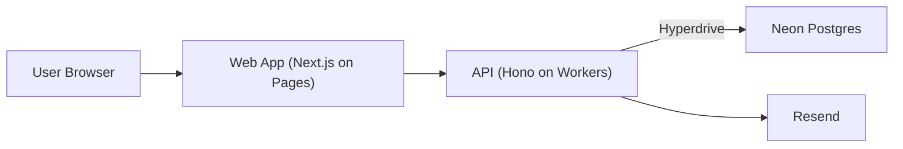

# Architecture

## System diagram

## Data model overview

- `users`: account identity and timezone.
- `sessions`: session tokens (DB-backed auth sessions).
- `event_types`: host-defined booking templates.
- `availability_rules`: recurring weekly availability windows.
- `availability_overrides`: date-specific changes.
- `bookings`: confirmed/canceled/rescheduled booking records.
- `webhook_subscriptions`: organizer-managed outbound webhook endpoints/secrets/event filters.
- `webhook_deliveries`: queued delivery attempts with retry state and final status.

## Critical flows

### Compute availability

1. Load weekly availability rules for organizer.
2. Apply date overrides for query range.
3. Remove windows blocked by existing bookings and buffers.
4. Return timezone-aware slots in paginated form.

### Book slot (no double-book)

1. Client selects slot and submits booking request.
2. API validates payload with Zod.
3. API runs DB transaction and inserts booking.
4. Unique slot constraint rejects race-condition duplicates.
5. API returns success and sends confirmation email.

### Reschedule/cancel

1. User opens secure tokenized link from email.
2. API validates token, permission, and booking state.
3. API updates booking status/history atomically.
4. API sends reschedule/cancel email notification.

### Webhook delivery loop (Feature 4)

1. Booking lifecycle writes enqueue delivery rows for subscribed organizers.
2. Runner endpoint selects due `pending` deliveries.
3. API signs payload (`X-OpenCalendly-Signature`) and posts to target URL.
4. Non-2xx / transient failures reschedule with exponential backoff.
5. Delivery marks `succeeded` or `failed` after bounded attempts.

## Correctness and idempotency notes

- Booking writes must be transactional.
- Slot uniqueness is enforced in DB (not only in app logic).
- Email sends should be keyed by idempotency token to avoid duplicates on retries.
- Webhooks use exponential backoff and dedupe by subscription + event id.
