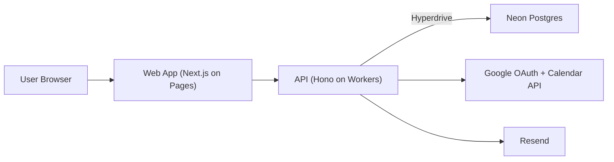

# Architecture

## System diagram

## Data model overview

- `users`: account identity and timezone.
- `sessions`: session tokens (DB-backed auth sessions).
- `event_types`: host-defined booking templates.
- `teams`: organizer-owned teams.
- `team_members`: team membership + role.
- `team_event_types`: links a base event type to a team scheduling mode (`round_robin`/`collective`).
- `team_event_type_members`: required members for a team event type.
- `availability_rules`: recurring weekly availability windows.
- `availability_overrides`: date-specific changes.
- `bookings`: confirmed/canceled/rescheduled booking records.
- `team_booking_assignments`: per-member slot assignment rows for team bookings (enforces member-level uniqueness).
- `calendar_connections`: encrypted OAuth credentials + sync cursor/status per user/provider.
- `calendar_busy_windows`: normalized external busy windows used for slot conflict blocking.
- `webhook_subscriptions`: organizer-managed outbound webhook endpoints/secrets/event filters.
- `webhook_deliveries`: queued delivery attempts with retry state and final status.

## Critical flows

### Compute availability

1. Load weekly availability rules for organizer.
2. Apply date overrides for query range.
3. Remove windows blocked by existing bookings and buffers.
4. Remove windows blocked by synced external busy windows (Feature 6).
5. Return timezone-aware slots in paginated form.

### Book slot (no double-book)

1. Client selects slot and submits booking request.
2. API validates payload with Zod.
3. API runs DB transaction and inserts booking.
4. Transaction re-check includes external busy windows.
5. Unique slot constraint rejects race-condition duplicates.
6. API returns success and sends confirmation email.

### Reschedule/cancel

1. User opens secure tokenized link from email.
2. API validates token, permission, and booking state.
3. API updates booking status/history atomically.
4. API sends reschedule/cancel email notification.

### Webhook delivery loop (Feature 4)

1. Booking lifecycle writes enqueue delivery rows for subscribed organizers.
2. Runner endpoint selects due `pending` deliveries.
3. API signs payload (`X-OpenCalendly-Signature`) and posts to target URL.
4. Non-2xx / transient failures reschedule with exponential backoff.
5. Delivery marks `succeeded` or `failed` after bounded attempts.

### Team booking (Feature 5)

1. Public API resolves team event type (`team + mode + required members`).
2. API computes member-level slot availability from each member's rules/overrides and confirmed bookings.
3. `round_robin`: choose one assignee using persistent cursor rotation.
4. `collective`: require slot intersection across all required members.
5. Inside transaction, API writes booking + action tokens + team assignment rows.
6. Unique constraints prevent double-booking races at member slot level.
7. Cancel/reschedule keeps token flow unchanged and updates/deletes assignment rows accordingly.

### Calendar sync hardening (Feature 6)

1. Authenticated organizer starts Google OAuth (`/calendar/google/connect/start`).
2. API signs state with `SESSION_SECRET` and returns provider auth URL.
3. OAuth completion exchanges code, encrypts tokens, and upserts `calendar_connections`.
4. Sync endpoint fetches Google free/busy and writes normalized rows into `calendar_busy_windows`.
5. Availability + booking commit paths treat those windows as hard conflict blocks.
6. Disconnect removes connection + busy-window cache atomically.

## Correctness and idempotency notes

- Booking writes must be transactional.
- Slot uniqueness is enforced in DB (not only in app logic).
- Team bookings additionally enforce per-member slot uniqueness through `team_booking_assignments`.
- External calendar conflicts are enforced at compute-time and re-checked at commit-time.
- Email sends should be keyed by idempotency token to avoid duplicates on retries.
- Webhooks use exponential backoff and dedupe by subscription + event id.
