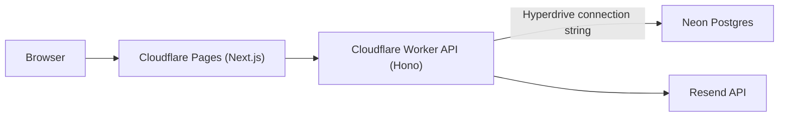

# Stack Decisions

## Goals for this stack

- Keep infra costs at or near $0/month on free tiers.
- Maintain strong booking correctness under concurrent requests.
- Use simple, composable tools with strong TypeScript support.

## Tools and why

| Layer | Tool | Why |
| --- | --- | --- |
| Frontend | Next.js (App Router) | Fast UI iteration, route conventions, strong TS support, Cloudflare Pages compatibility |
| API | Cloudflare Workers + Hono | Low-latency edge execution and lightweight routing |
| Database | Neon Postgres (free plan) | Managed Postgres with 100 CU-hours/project/month |
| DB access in Workers | Hyperdrive + native `pg` | Connection reuse/pooling and lower latency from edge to Postgres |
| ORM/migrations | Drizzle ORM + drizzle-kit | Type-safe schema and explicit SQL migrations |
| Shared contracts | Zod | Runtime validation plus inferred TS types |
| Transactional email | Resend | Free-tier transactional email for booking lifecycle events |
| Testing | Vitest + Playwright | Fast unit tests and one end-to-end booking path |
| Code quality | ESLint + Prettier | Consistent code quality and formatting |

## How components connect

## Hyperdrive + Neon rule

- Use native Postgres drivers (`pg` or `postgres`) with Hyperdrive connection strings.
- Do not use Neon serverless driver with Hyperdrive.
- Do not stack Hyperdrive pooling with Neon pooled connection endpoints.
- Neon is the only supported database provider for this repository.

Current code example: `apps/api/src/index.ts` uses `pg.Client` with `env.HYPERDRIVE.connectionString`.

## Setup steps

1. Create Neon project and copy the direct Postgres URL.
2. Create Cloudflare Hyperdrive config pointed at Neon.
3. Bind Hyperdrive in `apps/api/wrangler.toml` as `HYPERDRIVE`.
4. Set `DATABASE_URL` locally to the Neon direct Postgres URL for migrations and seed scripts.
5. Deploy API Worker, then deploy web app to Pages.

## Production routing (Feature 19)

- Worker production route is configured as `api.opencalendly.com/*` in `apps/api/wrangler.toml` (`[env.production]`).
- Deploy commands:
  - API: `npm run deploy:api:production`
  - Web: `npm run deploy:web:production`
  - Domain verification: `npm run domain:check:production`
- Domain wiring steps (Porkbun + Cloudflare): `docs/CLOUDFLARE_DOMAIN_SETUP.md`

Useful references:

- [Neon docs](https://neon.com/docs)
- [Cloudflare Hyperdrive docs](https://developers.cloudflare.com/hyperdrive/)
- [Cloudflare Workers docs](https://developers.cloudflare.com/workers/)
- [Cloudflare Pages docs](https://developers.cloudflare.com/pages/)
- [Resend docs](https://resend.com/docs)
- [Drizzle docs](https://orm.drizzle.team/docs/overview)

## Platform hardening decisions (Feature 9)

- Branch protection is enabled on `main` with:
  - required checks: `lint-test-typecheck`, `Greptile Review`, `CodeRabbit`, `GitGuardian Security Checks`, `trigger-coderabbit-review`
  - required PR reviews: 1 approval
  - required conversation resolution: enabled
  - direct pushes blocked by branch protection policy
- `@cloudflare/next-on-pages` deprecation handling decision:
  - keep current adapter for now to avoid mid-feature deployment churn
  - plan migration to OpenNext before `v1.0.0` with dedicated validation checklist (preview deploy parity, env parity, rollback path)
- Next.js multiple-lockfile warning strategy:
  - repository source of truth remains `/open-calendly/package-lock.json`
  - if a parent-directory lockfile exists, warning is expected locally and does not affect runtime behavior
  - run Node/npm commands from repository root to keep deterministic workspace resolution
